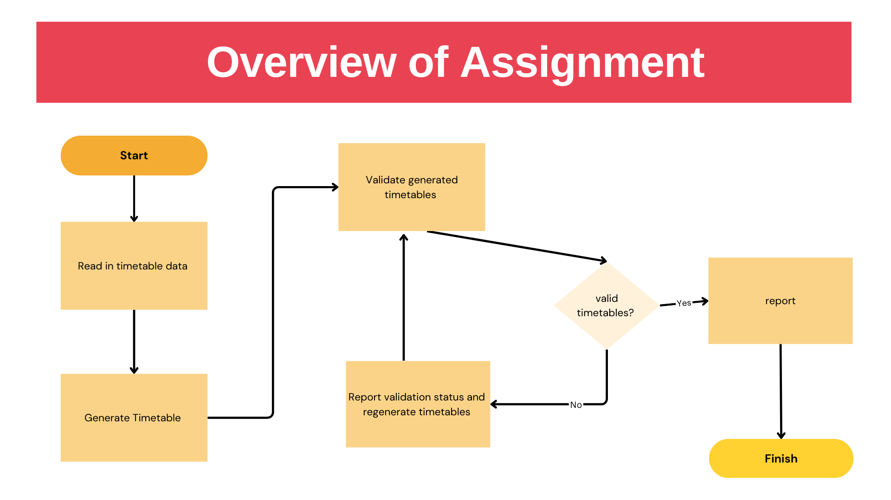

# 1. Timetable validation and generation - Phase 1

## Overview of full Assignment: 

A timetabling system needs to match different data to generate and validate timetables. The validation of a timetable ranges from  components to the system  
### e.g. Component level (using student as an example) 

e.g. Student
 - Is a  student name 'valid' i.e. correctly structured (not too long, no digits etc)
 - Are all the fields of a student record valid? So all the fields in the  student record are valid.
 

 Then list of students: 
  - what is the  list of 'validated' students (no errors in there) 
  - what is the list of 'rejected' student records 

### System level
 These checks can range from :
  - Has a lecturer been timetabled for too many hours (more than their allocated 'availabe hours' )
  - are students double booked? 
  - are lecturers double booked?

There will be generation of timetables (having validated the input) 

You will be  tasked with developing an ER Diagram for a timetabling system. (ER outline given). You will  asked to perform some checks on this data (e.g are all fields populated, valid etc) and write various reports, including
     - formatted verison of these module descriptors 
     - logs of error modules (those that have not passed the validation checks) to documents (e.g. docx, md)

 

## Phase 1 of Assignment
For this phase, you will be 
 - developing the ER diagram for the system
 - creating and populating corresponding csv files
 - Using the cassava package to read in  the csv files to appropriate structures. 
- printing out the contents of the csv files to the screen to check your work. 
 - starting to validate fields of particular entities, e.g. Lecturer, Student, Department etc. 
 - Listing valid, invalid lectures given the validation rules. 

 

###  Data Set 
The data is in the format of a csv file. lecturer.csv is given in your starter code. You need to generate the other csv files. (Use the minimum number of fields needed.)

You wlil be asked to perform  checks on the data and to generate reports on the validations. 

