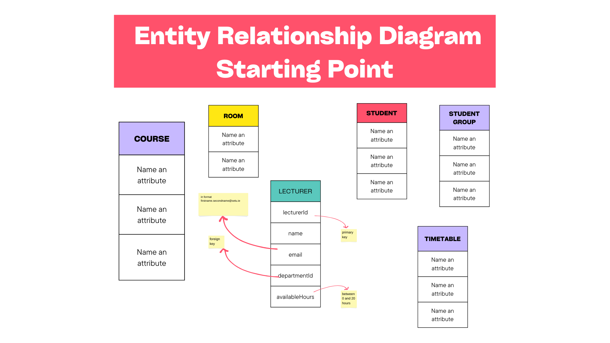
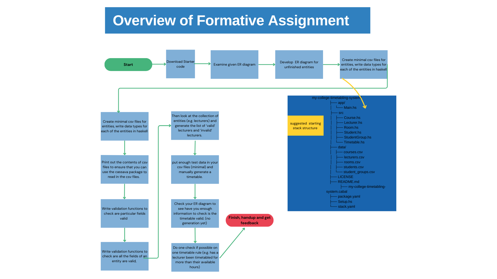

# 4. Specification

# Validation of fields in a timetabling syste

## Aim

Given  starter code and ER diagrams, develop an ER diagram for a timetabling system. The partial ER Diagram is here:

Then using the starter code (downloaded from [here](https://classroom.github.com/a/T99Cuzz7))

Add more validation functions to Lecturer.hs (as per validations given in previous tab)

Write more code to fulfill the steps given in this diagram: 

Once you have finished those steps you can do a final push on github classroom.

