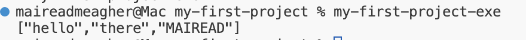

# Example using my-first-project - part three - updating app code to call the new library code

 - We wish to change the code of the 'Driver' (in /app/Main.hs)

We will use the *splitOnSpace* function from LibSplit, so we have 

~~~haskell
-- /app/Main.hs
module Main (main) where

import Split.LibSplit (splitOnSpace)

main :: IO ()
main = print splitOnSpace 
~~~

Note the import statement and we are explicitly mentioning the splitOnSpace function. If we don't explicitly mention any function, all get imported. If we mention some names, only these get imported. IT is better to explicitly state which to import as this adds clarity to the code. 

Now, run 

~~~
$stack build
$stack install
$my-first-project-exe
~~~

A sample run : 

