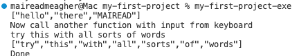

# Example using my-first-project - part four - updating app code to change and call the new library code 

1. We will add a new function to LibSplit, this time to accept the String as a parameter
2. We will change the app/Main to call both functions

## Add new function to LibSplit

As well as the original function (***splitonSpace***)that has the String hardcoded, we now add another one (***splitOnSpaceWithIinput***).

The LibSplit code now looks like 

~~~haskell

module Split.LibSplit where
import Data.List.Split (splitOn)  

splitOnSpace ::  [String]
splitOnSpace  =  splitOn " " "hello there MAIREAD" 

splitOnSpaceWithInput :: String->   [String]
splitOnSpaceWithInput input = splitOn " " input

~~~

We will now call  the *splitOnSpaceWithInput* function from LibSplit, so we have 

~~~haskell
-- /app/Main.hs
module Main (main) where

import Split.LibSplit (splitOnSpace, splitOnSpaceWithInput)

main :: IO ()
main = do 
    print splitOnSpace 
    putStrLn "Now call another function with input from keyboard"
    input <- getLine
    print (splitOnSpaceWithInput input)
    putStrLn "Done"
~~~

Note the import statement - we have added the splitOnSPaceWithInput function to the import statement.

Now, run 

~~~
$stack build
$stack install
$my-first-project-exe
~~~

A sample run using both functions: 

***Note***
~~~haskell
 input <- getLine   -- this takes input from keyboard 
                    -- and puts it into the input variable
~~~

This ***<-*** symbol is used for IO interactions only, i.e. taking input from the outside world (e.g. keyboard) and putting the input value into the variable on the Left Hand Side of the expression. 