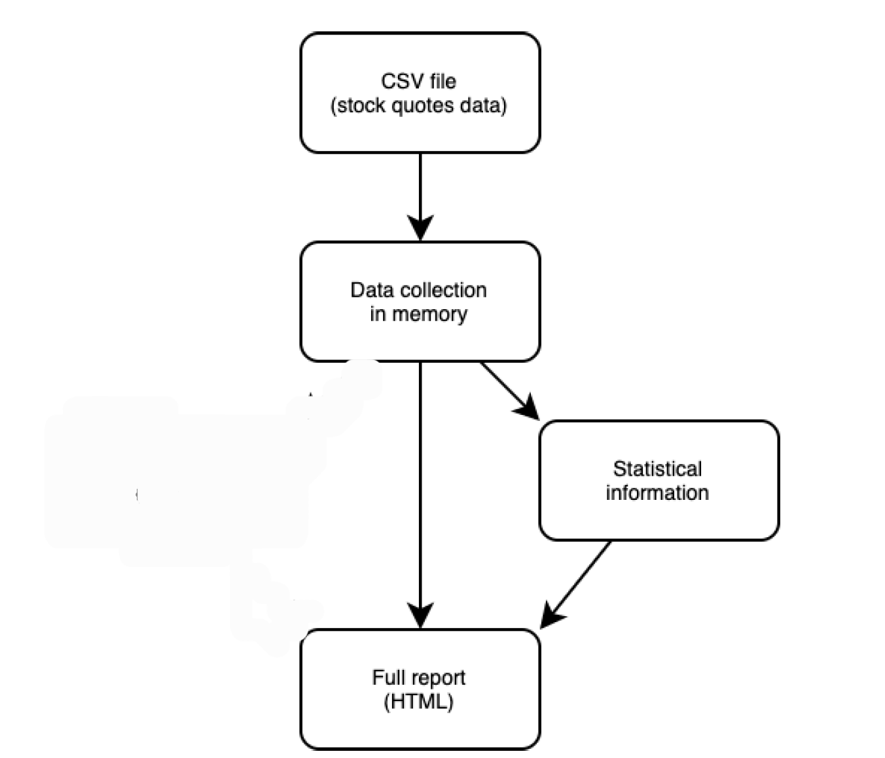
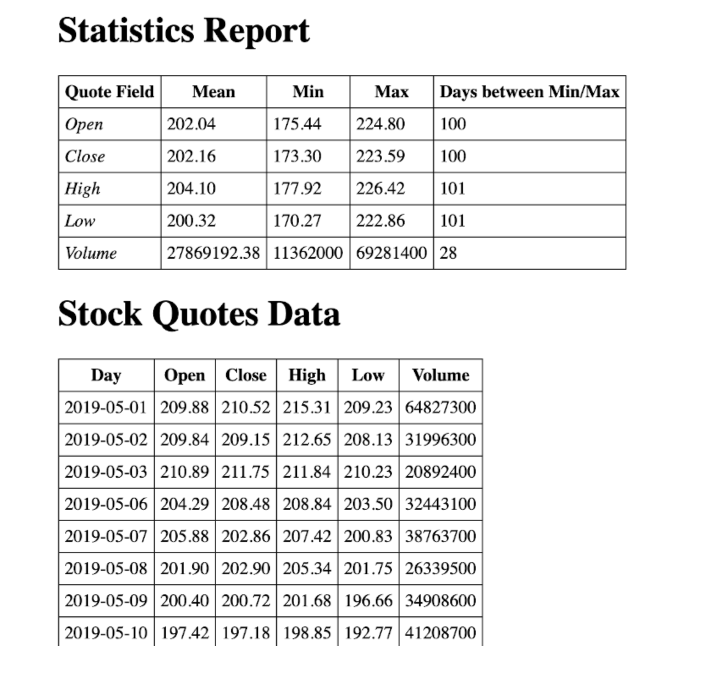
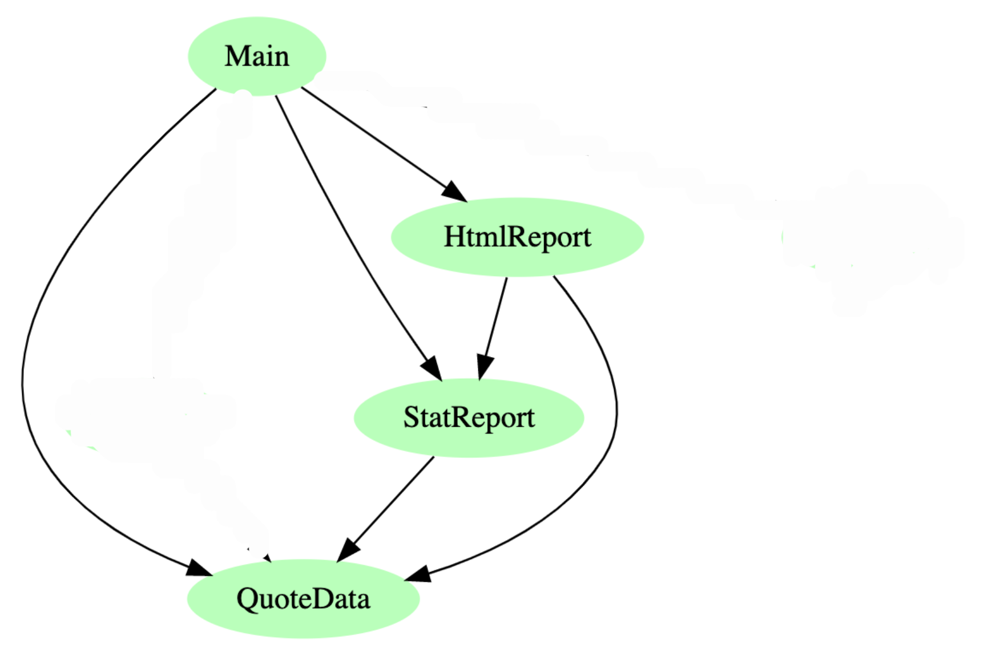
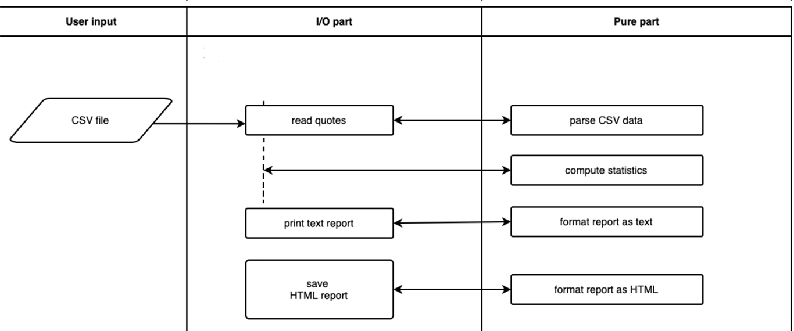
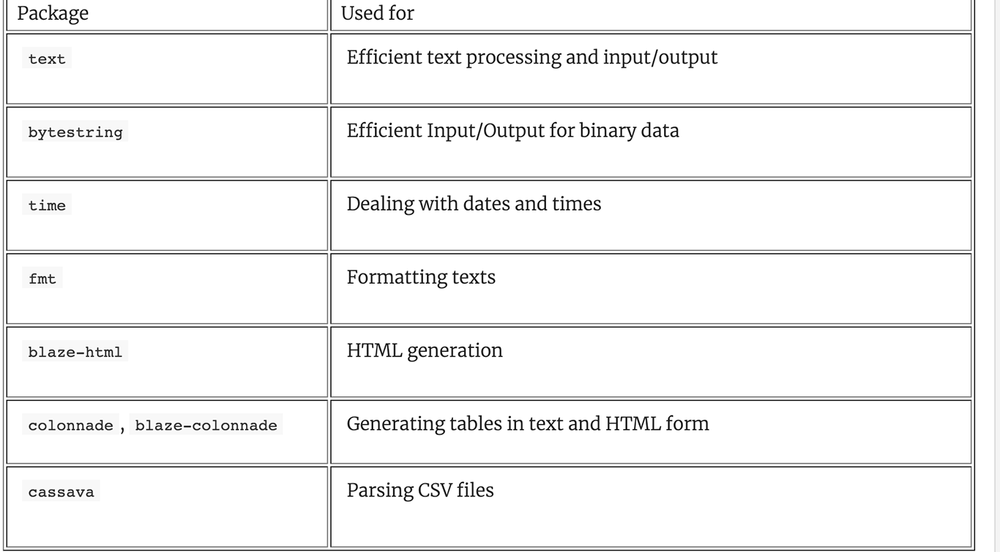

## Overview

The overall task is as follows: we take the historical quotes data for some joint-stock company in CSV format (a text file with comma-separated values), analyze these data and prepare a statistical report (as a text and an HTML document). See below  the overall data flow of the resulting program: we need to read the CSV file into a collection of some data type values and then process this collection in order to gather statistical information, prepare a final report in the form of a hmtl file.




The structure of the data is: 

```
day,close,volume,open,high,low
2019-05-01,210.520004,64827300,209.880005,215.309998,209.229996
2019-05-02,209.149994,31996300,209.839996,212.649994,208.130005
2019-05-03,211.75,20892400,210.889999,211.839996,210.229996
2019-05-06,208.479996,32443100,204.289993,208.839996,203.5
2019-05-07,202.860001,38763700,205.880005,207.419998,200.830002
2019-05-08,202.899994,26339500,201.899994,205.339996,201.75
2019-05-09,200.720001,34908600,200.399994,201.679993,196.660004
...
```


The first line lists the names of the six fields, and every other line of this file contains their corresponding values:

- `day` is the date of the stock transaction
- `close` is the share price at the close of business
- `volume` is the total number of shares of a stock traded during the day
- `open` is the price at the opening
- `high` is the highest price during the day
- `low` is the lowest price during the day


We wish to input the following to run the application:

- the name of the csv file containing the data
- the name of the HTML file to generate


### Output 

We look at the  following statistics: the mean, minimum, and maximum values of the fields, and the number of days between reaching minimum and maximum values. The following is a sample "statistical report" which we plan to generate: 

```
+-------------+-------------+----------+----------+----------------------+
| Quote Field | Mean        | Min      | Max      | Days between Min/Max |
+-------------+-------------+----------+----------+----------------------+
| Open        | 202.04      | 175.44   | 224.80   | 100                  |
| Close       | 202.16      | 173.30   | 223.59   | 100                  |
| High        | 204.10      | 177.92   | 226.42   | 101                  |
| Low         | 200.32      | 170.27   | 222.86   | 101                  |
| Volume      | 27869192.38 | 11362000 | 69281400 | 28                   |
+-------------+-------------+----------+----------+----------------------+
```


We  want to generate an HTML report that consists of the following:

- statistical information
- raw data




## Project structure

Let’s think what we should do in this project:

- read in names of csv file (for the quote data) and html file to be generated
- read quote data from a CSV file
- compute statistics
- prepare reports on statistical info in text and HTML


We will split the required functionality over the following several modules:

- `QuoteData` for describing data types we are going to use throughout the project
- `StatReport` for computing statistics and preparing a report in a text form
- `HTMLReport` for generating a report in an HTML document


We also need the `Main` module to connect the program components all together and drive the whole program. The diagram below demonstrates the module structure for this program with arrows pointing to the imported modules.



### Main project data types, functions and a flowchart

We can now look at  the program functionality with types and functions. Below  is an informal flowchart that presents the proposed structure of the program. There, you can see user input and both the I/O and pure parts of the program.




We will need data types to represent the following:

- Command-line arguments (`Params`)
- Quote data for one day (`QuoteData`)
- Some collection with all the data (let’s call it `QuoteDataCollection` for now)
- Computed statistical information (`StatInfo`)
- A report as an HTML document (`Html`)

The program should start by reading user input in the form of prompted input (normally a list of `String`).   Once we we know where the data is coming from (csv file) and name of the html file to be created, we can start working with data:


In this next function we’ll need to read the stock quotes data from the CSV file:

```haskell
readQuotes :: FilePath -> IO QuoteDataCollection
```
This method allows you to test the parsing at the stack ghci level. The code here is used in the final main function. 

Compute the statistical information (purely!):

```haskell
statInfo :: QuoteDataCollection -> StatInfo
```

Prepare the text report (again, purely!):

```haskell
textReport :: StatInfo -> String
```


Finally, we generate (purely) and save an HTML document to a file:

```haskell
htmlReport :: QuoteDataCollection -> StatInfo -> Html
saveHtml :: FilePath -> Html -> IO ()
```

We’ll refine the types and names of these functions later, but even now, they clearly represent the program functionality.


While implementing this project, we should discuss and solve many common practical problems, including:

- Representing data — we have to use several data types including something for dates;
- Parsing CSV files—We will use  the `cassava` package;
- Formatting reports - a report is text with data structured in some way. We will use the **fmt** package. We will use  the `colonnade` package to format the table output. This will be useful for the generation of the  HTML. We will use the `blaze-html` package to generate the HTML from the formatted tables. 

- Maintaining a clear division between pure and I/O parts of the program—We’ll aim to keep the latter as small as possible.

In summary below are the packages used 

