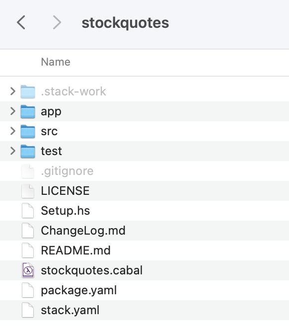

# Structure used - Stack 

We will use the Stack structure, using the default structure created as a result of the following command

```terminal
$ stack new stockquotes
```

This should look like this: 
 

Now you should download the data from from here: [quotes.csv](archives/quotes.csv)

Now copy this file to the root directory of your stack structure. We will now start to build the structure. 


## Notes on dependencies

One of the main reasons for using Stack with Haskell is to manage dependencies. 

When you usually create a new Stack project, (by writing 

```
$ stack new stockQuote
```

it creates a sandbox, with a full installation of GHC (latest by default). 

The package.yaml will include any needed dependencies (see given code).
