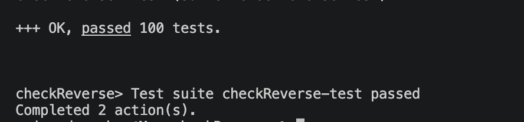

# QuickCheck

## Using QuickCheck
We want to see how a simple function and simple property  works with QuickCheck.

QuickCheck is a tool that can be used to test properties of functions.

We look at the reverse function (You should put this in your /src directory as Reverse.hs): 

```haskell
reverse :: [a] -> [a]

reverse [] = []

reverse (x:xs) = reverse xs ++ [x]
```

We can use QuickCheck to test the property that the reverse of a list is its reverse., i.e. that `reverse (reverse xs) == xs`.

For the first time, we now to to the `test` subdirectory in Stack, and go directly to the `Spec.hs` We write a property like this:

```haskell
prop_reverseTwice :: [Int] -> Bool
prop_reverseTwice xs =
  reverse (reverse xs) == xs
```
and then 

```haskell
main :: IO ()
main = quickCheck prop_reverseTwice
```

To run this (using all defaults), type `stack test`.


Note that you do not need anything in the `app/Main.hs' file. 

You should get something like this:



To see the full solution see 
here: [QuickCheck](./archives/checkReverse.zip)